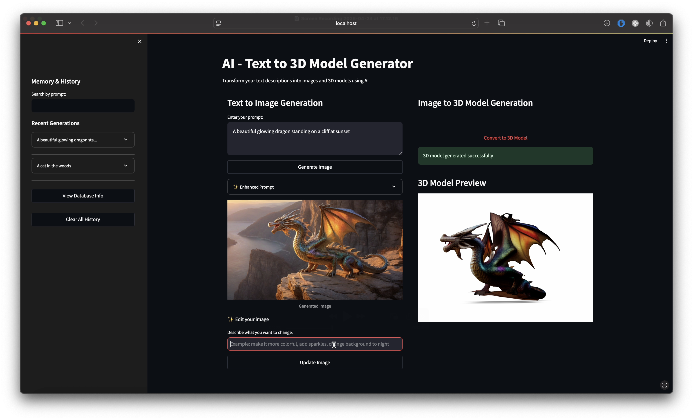

# AI - Text to 3D Model Generator

Convert text descriptions into images and 3D models using AI. This application combines local LLM capabilities with Openfabric's image and 3D model generation services.

## Installation & Setup

### Prerequisites

1. **Install Ollama**

   ```bash
   # Install Ollama from https://ollama.ai/
   # Then pull the LLaMA model
   ollama pull llama3:latest
   ```

2. **Start Ollama Server**

   ```bash
   ollama serve
   ```

3. **Python Environment Setup**

   ```bash
   # Create a virtual environment
   python -m venv venv

   # Activate the environment
   # On macOS/Linux:
   source venv/bin/activate

   # On Windows:
   venv\Scripts\activate

   # Install requirements
   pip install -r requirements.txt
   ```

4. **Run the Application**

   ```bash
   streamlit run app/gui.py
   ```

## Features

1. **Text-to-Image Generation**

   - Enhanced prompts
   - High-quality image generation
   - Context-aware modifications

2. **Image-to-3D Conversion**

   - 3D model generation
   - Preview capabilities

3. **Memory System**

   - Session-based short-term memory
   - SQLite-based long-term storage
   - Edit history tracking
   - Searchable generations

4. **User Interface**

   - Streamlit interface
   - History access
   - Real-time preview and tracking

## Technical Details

The application uses:

- Openfabric SDK and AI services
- Ollama (llama3:latest) for local LLM capabilities
- SQLite for persistent storage
- Streamlit for the UI

## Architecture

### Project Structure

```
app/
├── config/                         # Configuration files
├── core/                           # Core functionality
│   ├── __init__.py
│   ├── remote.py
│   └── stub.py
├── managers/
│   ├── llm_manager.py              # Local LLM interactions
│   ├── memory_manager.py           # Memory and storage
│   └── openfabric_manager.py       # Openfabric API integration
├── utils/
│   └── utils.py                    # Utility functions
├── gui.py                          # Streamlit UI
└── main.py
```

### Core Components

1. **LLM Manager** (`app/managers/llm_manager.py`)

   - Handles communication with local Ollama instance
   - Enhances user prompts with artistic details
   - Provides context-aware prompt enhancement

2. **Openfabric Manager** (`app/managers/openfabric_manager.py`)

   - Integrates with Openfabric's AI services
   - Handles image generation and 3D model generation
   - Manages API authentication and responses

3. **Memory Manager** (`app/managers/memory_manager.py`)
   - Implements memory system
   - Manages SQLite database operations
   - Handles file storage and cleanup

### Database Schema

The application uses SQLite for persistent storage. The main table structure is:

- **id**: Unique identifier for each generation
- **prompt**: Original user input prompt
- **enhanced_prompt**: AI-enhanced version of the prompt
- **image_path**: Path to the generated image file
- **model_path**: Path to the generated 3D model file
- **created_at**: Timestamp of generation
- **metadata**: Additional information in JSON format (edit history, tags, etc.)

## Technical Details

The application uses:

- Openfabric SDK and AI services
- Ollama (llama3:latest) for local LLM capabilities
- SQLite for persistent storage
- Streamlit for the UI

## Usage

1. Enter a text prompt describing your desired image
2. Generate the image using the enhanced prompt
3. Convert the generated image to a 3D model
4. Edit and refine your generations as needed
5. Use the sidebar to access history and previous generations
6. Search through your generations to find specific items

## Application Screenshot



## Troubleshooting

### Common Issues

1. **ImportError: cannot import name 'has_resource_fields' from 'openfabric_pysdk.helper'**

   This error typically occurs when using Anaconda's Python instead of the virtual environment's Python. To fix:

   ```bash
   # 1. Deactivate any active environments (including conda)
   deactivate
   conda deactivate  # if using conda

   # 2. Create a fresh virtual environment
   python -m venv venv

   # 3. Activate the new environment
   source venv/bin/activate  # on macOS/Linux
   venv\Scripts\activate     # on Windows

   # 4. Install requirements
   pip install -r requirements.txt
   ```

   Verify you're using the correct Python:

   ```bash
   which python  # Should point to your venv, not Anaconda
   ```
